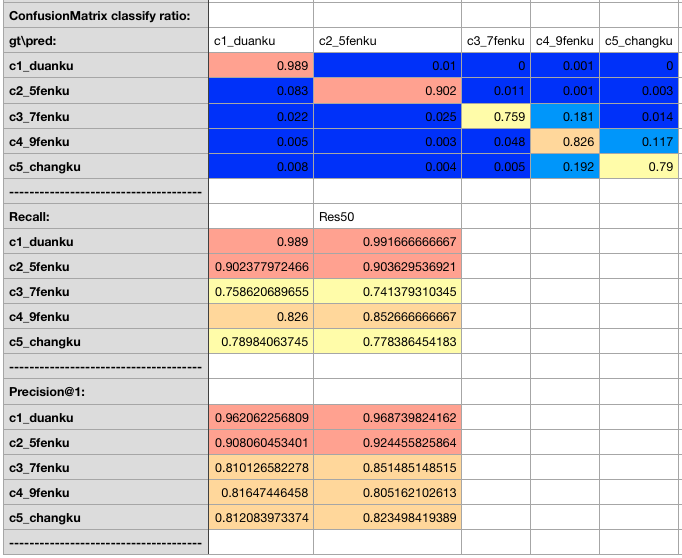

# 1. Pytorch-Multi-Task-Multi-class-Classification

**MTMC-Pytorch:**
MTMC-Pytorch = Multi-Task Multi-Class Classification Project using Pytorch.

**目的：**
旨在搭建一个分类问题在Pytorch框架下的通解，批量解决单任务多分类问题、多任务多分类问题。

**备注：**
1. 通用的，而不是对任意问题都是最优的；
2. 目的是集成分类问题诸多训练Tricks；
3. 项目不再更新，止步于Gluon CV；（https://github.com/dmlc/gluon-cv ，尽管他不是很完整。Ref: Bag of Tricks for Image Classification with Convolutional Neural Networks https://arxiv.org/abs/1812.01187v2 ）

# 2. Pytorch Version Info

```
$  conda list | grep torch
pytorch                   0.4.1           py36_cuda0.0_cudnn0.0_1    pytorch
torchvision               0.2.1                    py36_1    pytorch
```

**经验证，pytorch=1.3.0版本也是支持的。--2020.02.29**

# 3. Getting Started

## 3.1 Data Preparation

将样本整理成如下格式按文件夹存放：

```
MLDataloader load MTMC dataset as following directory tree.
Make sur train-val directory tree keeps consistency.

data_root_path
├── task_A
│   ├── train
│   │   ├── class_1
│   │   ├── class_2
│   │   ├── class_3
│   │   └── class_4
│   └── val
│       ├── class_1
│       ├── class_2
│       ├── class_3
│       └── class_4
└── task_B
    ├── train
    │   ├── class_1
    │   ├── class_2
    │   └── class_3
    └── val
        ├── class_1
        ├── class_2
        └── class_3

```

## 3.1 Train-Val Logs

MTMC自动解析任务获取类别标签、自适应样本均衡、模型训练、模型评估等过程。

你需要做的步骤如下：

Step 1. 修改```/src/bash_trainval_mtmc_resnet18_ft.sh```文件确认数据地址，模型参数训练参数等。

```
DATA=../data/pants
MAX_BASE_NUMBER=5000

ARC=resnet18
CLASS_NUM=24 # deprecated in mtmc

# 336X224--S11X7--MP7X7--512*(11-7+1)=512*5=2560
# 960:640 = 3:2 = 224*1.5:224 = 336:224 = 384:256 = 1.5:1
DATALOADER_RESIZE_H=384
DATALOADER_RESIZE_W=256
INPUTLAYER_H=336
INPUTLAYER_W=224
FC_FEATURES=2560

EPOCHS=120
FC_EPOCHS=50

BATCHSIZE=256
WORKERS=8

LEARNING_RATE=0.01
WEIGHT_DECAY=0.0001

TRAIN_LOG_FILENAME=$ARC"_train_`date +%Y%m%d_%H%M%S`".log
VAL_LOG_FILENAME=$ARC"_val_`date +%Y%m%d_%H%M%S`".log

python main_mtmc_resnet.py --data $DATA \
    --dataloader_resize_h $DATALOADER_RESIZE_H \
    --dataloader_resize_w $DATALOADER_RESIZE_W \
    --inputlayer_h $INPUTLAYER_H \
    --inputlayer_w $INPUTLAYER_W \
    --fc_features $FC_FEATURES \
    --max_base_number $MAX_BASE_NUMBER \
    --arc $ARC \
    --workers $WORKERS \
    --pretrained \
    --epochs $EPOCHS \
    --fc_epochs $FC_EPOCHS \
    --batch_size $BATCHSIZE \
    --learning-rate $LEARNING_RATE \
    --weight-decay $WEIGHT_DECAY \
    2>&1 | tee $TRAIN_LOG_FILENAME

echo "Train... Done."

python main_mtmc_resnet.py --data $DATA \
    --dataloader_resize_h $DATALOADER_RESIZE_H \
    --dataloader_resize_w $DATALOADER_RESIZE_W \
    --inputlayer_h $INPUTLAYER_H \
    --inputlayer_w $INPUTLAYER_W \
    --fc_features $FC_FEATURES \
    --arc $ARC \
    --workers $WORKERS \
    --evaluate \
    --resume model_best_checkpoint_$ARC.pth.tar \
    --batch_size $BATCHSIZE \
    2>&1 | tee $VAL_LOG_FILENAME

echo "Val... Done."
```

Step 2. 执行```/src/bash_trainval_mtmc_resnet18_ft.sh```文件

```
$ bash bash_trainval_mtmc_resnet18_ft.sh
```

Step 3. 在```/src``` & ```/src/vals```中查看训练日志和结果，日志文件保存为*.txt文件，使用Excel打开展示结果如下：

示例任务：裤子属性分析，分为两个任务，裤型分类和裤长分类；

**裤型：**


**裤长：**

